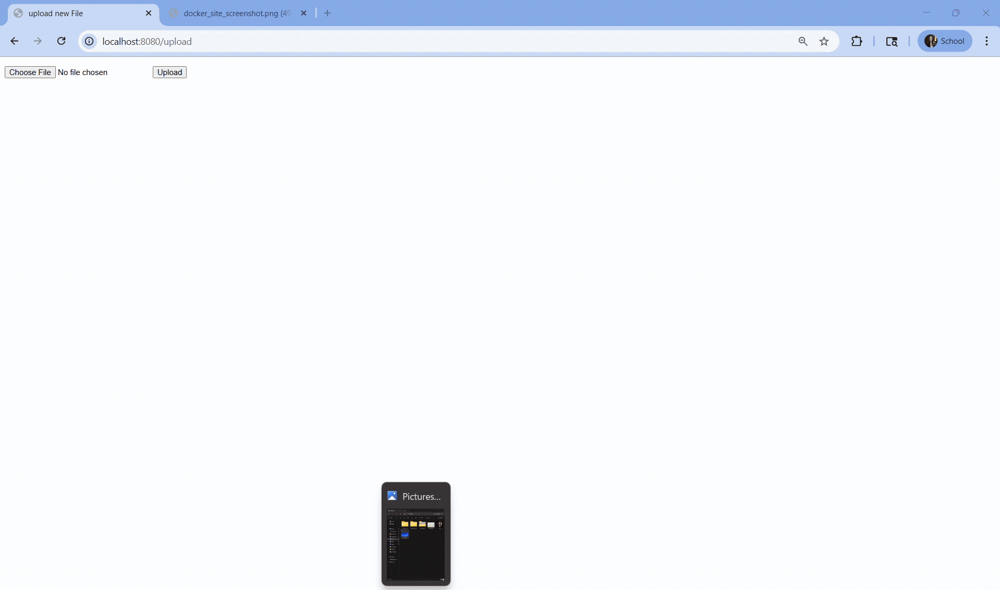

# Flask on Docker 

## Repository Overview

This repository contains a containerized Flask web application that I built by Dockerizing Flask with Postgres, Gunicorn, and Nginx. 


The goal of the project was to take a simple Flask API and configure it for both development and production environments using Docker. 
- In development, the app runs with Docker Compose and connects to a PostgreSQL database container.
- In production, the setup uses Gunicorn as the WSGI server and NGINX as a reverse proxy to handle incoming requests and serve static and user-uploaded media files.


The project also includes separate environment configurations, multi-stage Docker builds for smaller and more secure production images, and shared Docker volumes for persistent database and file storage. Overall, this repo demonstrates how to structure, containerize, and deploy a full-stack Flask application using Docker-based workflows.

---

## Demo

Below is a short demo of the application running locally:

<!-- Replace the link below with your uploaded GIF file -->



---

## Build Instructions
### Development
Start development environment
```
$ docker compose up -d --build
```

Initialize database
```
$ docker compose exec web manage.py create_db
```

Access database
```
$ docker compose exec db psql --username=hello_flask --dbname=hello_flask_dev
```

### Production
Start production environment
```
$ docker compose -f docker-compose.prod.yml up -d --build
```

Initialize database
```
$ docker compose -f docker-compose.prod.yml exec web python manage.py create_db
```

Access database
```
$ docker compose exec db psql --username=hello_flask --dbname=hello_flask_prod
```
